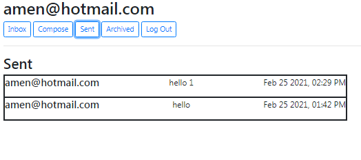
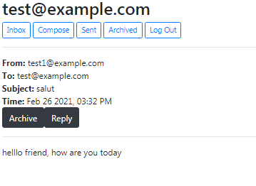
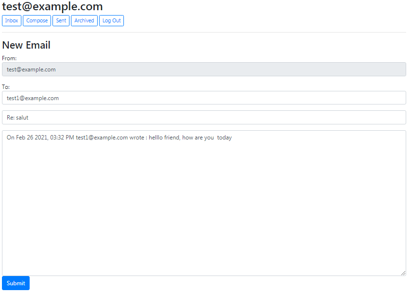

# Mail
I designed a front-end for an email client that makes API calls to send and receive emails.
Each time user clicks a button, he's not being taken to a new route or making a new web request, instead, this entire application is just a single page, with JavaScript used to control the user interface. You can take a closer look at the code :).
First, the user needs to login.
After logging in, user is able to send a mail to a another user from *Compose* tab

the sent mail will show in sender *Sent* tab  and in receiver *Inbox* tab  the mail with white background means user has read it, the gray background means he hasn't, to read it he just need to click on it and a mail page will appear 
We can notice *Archive* and *Reply* buttons, *Archive* button will transfer the mail from the *Inbox* tab to the *Archived* tab, to unarchive user just need to go to *Archived* tab and go to the same mail, the button will show as *Unarchive* clicking on it will unarchive this mail.
There's also *Reply* button, clicking on it will take the user to the *Compose* tab, it will automatically Pre-fill the *Recipient* to whoever sent the original mail, Pre-fill the *Subject* with *Re:* and the subject of the original mail, if the original mail already has *Re:* it won't do it again, the last thing is Pre-filling the *Body* with *On -time of original mail- -original Email sender- wrote: -original Email body-*

