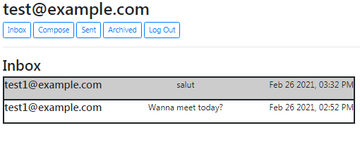

# Mail

> Inbox with a read and unread mail

---

### Table of contents
Headers location reference.

- [Description](#description)
- [How To Use](#how-to-use)
- [What have i used](#what-i-have-used)
- [Images](https://github.com/amen6/Mail/tree/main/Images)

---

## Description

   Mail is a front-end for an email client that makes API calls to send and receive emails. Each time user clicks a button, he's not being taken to a new route or making a new web request, instead, this entire application is just a single page, with JavaScript used to control the user interface. You can take a closer look at the code :).

#### What i have used

- HTML
- Css
- Python
- Json
- Django
- Bootstrap

[Back To The Top](#mail)

---

## How To Use

- ### Read Mail
  To read a [mail](https://github.com/amen6/Mail/blob/main/Images/Mail.png), user just need to *click* on the one he wants to read,
  he will the **Sender**, **Receiver**, **Date**, **Subject** and **Body**.  \
  There's also `Archive` and  `Reply` buttons. When user clicks on:

    - `Archive`: The mail will be transfered from the [Inbox](#inbox) tab to the [Archived](#archived) tab, to **Unarchive** mail, user just need to go to [Archived](#archived) tab and go to the same mail, the button will show as `Unarchive`, clicking on it will **Unarchive** this mail.

    - `Reply`: The user will taken to the [Compose](#compose) tab, it will automatically Pre-fill the *Recipient* to whoever sent the original mail, Pre-fill the *Subject* with `Re:` and the subject of the original mail, if the original mail already has `Re:` it won't do it again, the last thing is Pre-filling the *Body* with `On -time of original mail- -original Email sender- wrote: -original Email body-`
    > Check how [Reply](#https://github.com/amen6/Mail/blob/main/Images/Reply.png) works.

- ### Inbox
  User will see the mails that other users have sent to him, the mails with **gray** background means it's a unread mail, **white** background means user has read it.

- ### Compose
  It's for composing mails and sending them to other users,
  user should implement the **Receiver Email**, **Subject** and **Body**.
  After implement those informations, he just need to click `Submit` and the mail will be sent.

- ### Sent
  It shows all mails user have *sent* to others.

- ### Archived
  It shows the *Archived* mails.

[Back To The Top](#mail)

---
